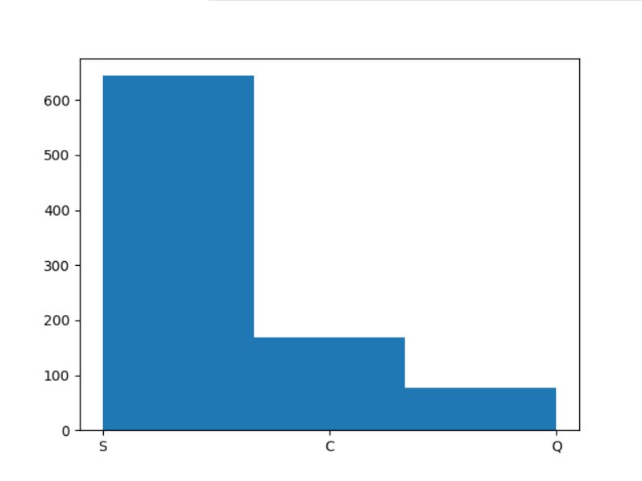
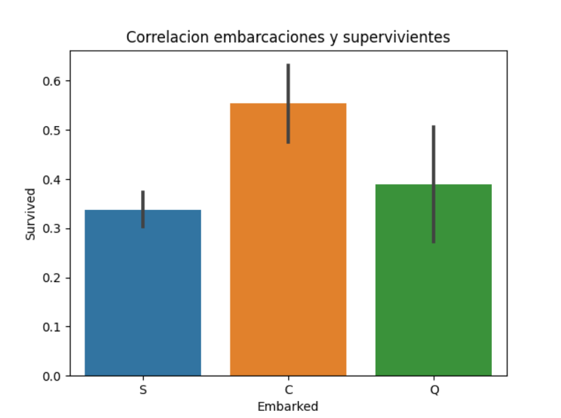
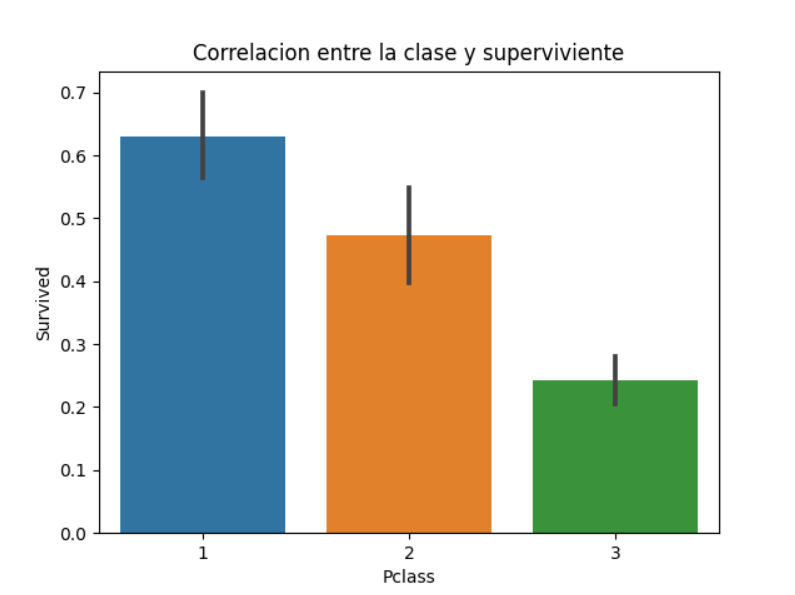
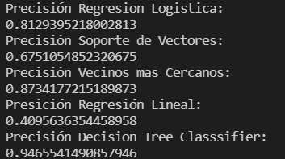
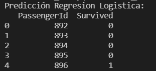
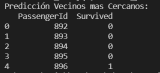

Proyecto de inteligencia artificial por Erick Garcia Valenzuela
Centro Regional de Estudios Superiores Palmore

En este proyecto se entrenaron cinco modelos de inteligencia artificial en base al dataset del titanic utilizando como lenguaje de programacion python.

## Requerimientos de instalacion

Asegurate instalar virtualenv y tener la carpeta.

Ejecutada la carpeta antes de inicar el archivo principal titanic.py 

Verifica las librerias de instalacion necesarias para ejecutar este proyecto en requirements.txt
 ------------------------------------------------------------------------------------------------------------------------------------
Los archivos correspondientes son el "test.csv" y "train.csv" que seran utilizados para el entrenamiento y prediccion de:

Regresión Logistica
Support Vector Machines
K Neighbors
Linear Regression
Decision Tree Classifier.

Tipo de embarcación.

Grafica donde se busca una correlación entre las embarcaciones con la supervivencia

Grafica donde se busca la correlación las clase de pasaje con la supervivencia.

Resultados de los modelos entrenados y su efectividad. Tuvo mas exito el Decision Tree Classifiere den entre los cinco. Subsecuentemente el K-Neighbors tuvo un buen radio de efectividad igualmente.

Predicciones de diferentes modelos con supervivientes. Esto ocurrio por la efectividad, los otros no tuvieron supervivientes.

